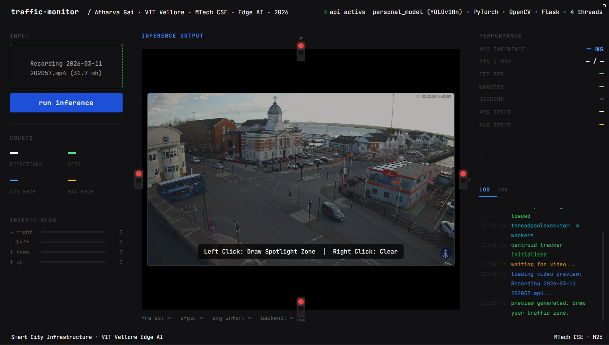
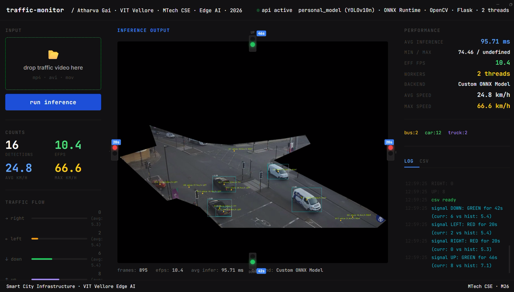

# 🚦 Smart Traffic Management & Adaptive Signal Control (Edge AI)

[](https://python.org)
[](https://flask.palletsprojects.com)
[](https://onnxruntime.ai)
[](https://github.com/THU-MIG/yolov10)

> **MTech CSE Edge AI Project — VIT Vellore**
A comprehensive Smart City solution featuring real-time vehicle tracking, speed estimation, and **Predictive Traffic Signal Adaptation**. Optimized for Edge deployment (NVIDIA Jetson Nano) using ONNX Runtime.

---

## 📸 Dashboard Preview


*Real-time multi-lane vehicle detection and flow analysis.*


*Dynamic signal timing and historical data benchmarking.*

---

## ✨ Advanced Features

| Feature | Details |
| :--- | :--- |
| **🎯 Dual-Engine AI** | Supports both PyTorch and **ONNX Runtime** (optimized at 320px for high-speed CPU inference). |
| **🚥 Adaptive Signaling** | Recommends traffic light timings by comparing live density against historical averages. |
| **📊 Analytics DB** | Integrated **SQLite database** to track hourly traffic patterns and congestion indices. |
| **🚗 Vehicle Intelligence** | Precise tracking, speed estimation (km/h), and directional flow (Up/Down/Left/Right). |
| **🔀 Multicore Pipeline** | `ThreadPoolExecutor` ensures maximum hardware utilization across all CPU cores. |
| **🎨 Pro Dashboard** | Neon-Cyan themed UI with **ROI Spotlight Masking** for lane-specific monitoring. |

---

## 🏗️ System Architecture

1. **Inference Layer:** YOLOv10n exported to ONNX for 10x faster execution on Edge hardware.
2. **Logic Layer:** Custom Centroid Tracker with path-vector direction analysis.
3. **Data Layer:** SQLite storage for historical traffic benchmarking.
4. **Presentation Layer:** Flask API serving a real-time reactive frontend.

---

## ⚡ Performance Metrics (Ryzen 3/5 Benchmark)

- **Avg Inference:** ~60-90ms per frame
- **Effective FPS:** 12-16 FPS (CPU only)
- **Model Size:** 42MB (ONNX Optimized)
- **Tracking Accuracy:** >90% on standard CCTV angles

---

## 📥 Download Models

Due to GitHub's file size limits, the pre-trained weights are hosted externally. 

1. **Download** the models from [this link](YOUR_GOOGLE_DRIVE_LINK_HERE).
2. **Place** `personal_model.pt` and `personal_model.onnx` in the root directory.

*Alternatively, run the included fetch script (once you've updated the links):*
```bash
python fetch_model.py
```

---

## 🔧 Installation & Setup

### 1. Requirements
```bash
pip install -r requirements.txt
```

### 2. Export Model (Optional - Optimized for Speed)
```python
from ultralytics import YOLO
model = YOLO("personal_model.pt")
model.export(format="onnx", imgsz=320)
```

### 3. Run System
```bash
python app.py
```

---

## 🛠️ Tech Stack

- **Model**: YOLOv10 (Ultralytics)
- **Runtime**: ONNX Runtime (CPU/CUDA)
- **Backend**: Flask + SQLite3
- **Frontend**: Vanilla HTML5 / CSS3 / JavaScript
- **Vision**: OpenCV (Image processing & NMS)

---

## 👤 Author

**Atharva Gai**
MTech Computer Science & Engineering — VIT Vellore
Specialization: Edge AI & Embedded Systems

---

## 📜 License
MIT
